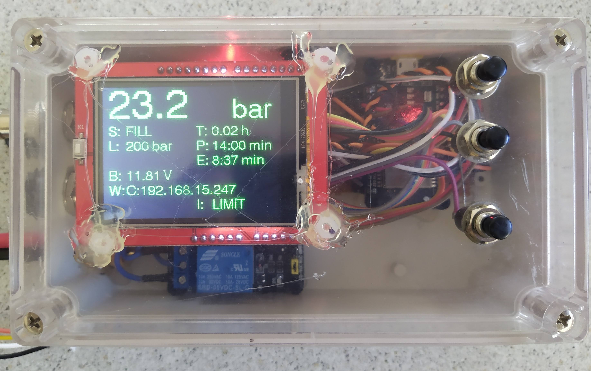

# Compressor Monitor

Monitor / shut off your dive compressor with an ESP32 board.

## Parts list:

- ESP32 board (https://www.aliexpress.com/item/32801296418.html) as the controller;
- pressure sensor (https://www.aliexpress.com/item/32397492502.html), connected to ADC through a resistive voltage divider;
- relay module (https://www.aliexpress.com/item/33019827278.html), to disable the engine's ignition when over the pressure limit;
- display module (https://www.aliexpress.com/item/32840857700.html);
- voltage regulator (https://www.aliexpress.com/item/32266661300.html), can be replaced with any 5V source;
- piezo buzzer (https://www.aliexpress.com/item/32352820863.html), with a NPN transistor as a driver;
- buttons for input, connectors, case.

A detailed schematic will follow once I get around to it.
