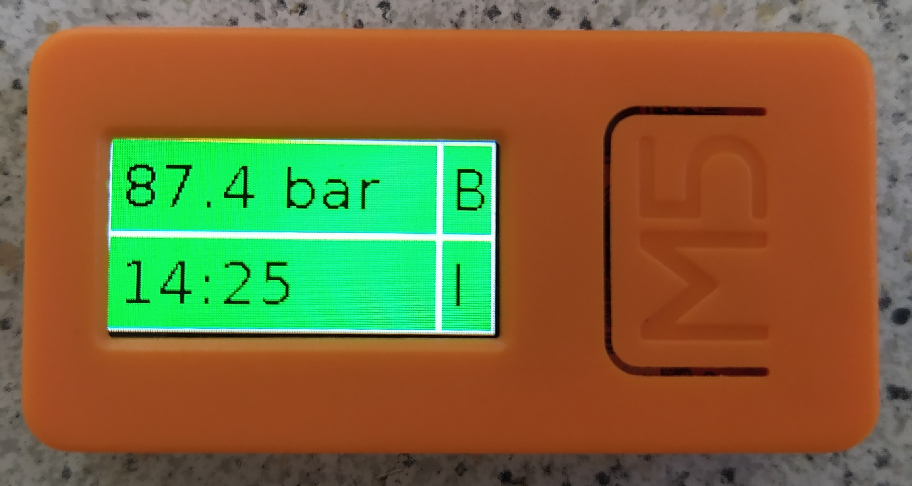
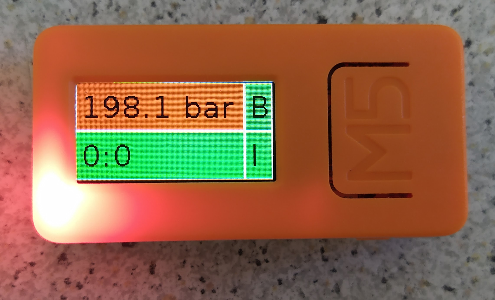
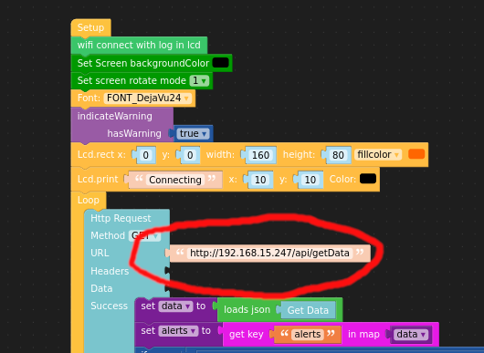

# M5Stick Client

Simple and inexpensive way to remotely monitor the status of the compressor:

Runs on a [M5StickC](https://shop.m5stack.com/products/stick-c) ESP32 development kit.

It shows the status of the main components of the system as 4 green / red fields: pressure close to full / purge needed / battery low / ignition off. In addition to this it shows the current pressure and time until purge is needed / estimated time until full (whichever is shorter) in numerical values.

Use https://flow.m5stack.com/ to edit / upload. The current version seems to have problems running in Chrome, but Firefox is working.

Needs a WiFi network setup on the m5stick, and the URL for the compressor monitor's API to be edited in the program:

